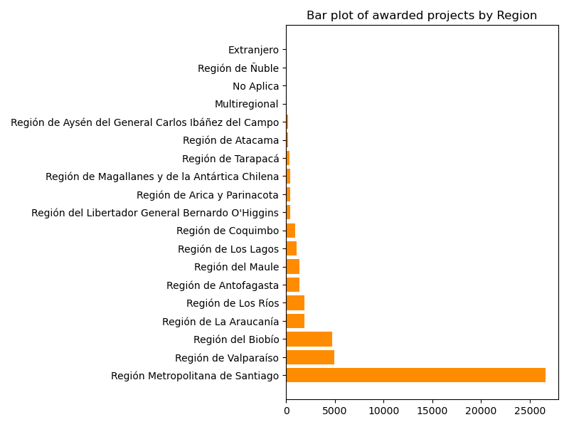

# Science and Technology in Chile: State funding between 1982 and 2022

Data analysis and visualization of Science and Technology projects that were given funding by the Chilean State between 1982 and 2022.

@Claudio-AhumadaL, 2023

 ## General Information

The aim of this project is to run an analysis over the Science and Technology funding awarded by the Chilean State between the years 1982 to 2022. I expect to run descriptive and exploratory analysis over the data, which was collected from the [OBSERVA](observa.minciencia.gob.cl) platform of the chilean Ministry of Science. I expect to condense my findings in a dashboard made using Tableau for proper visualization.

 ## Scope

 This project is an exploratory endeavor with the global objective of understanding the route that has been taken by the chilean Ministry of Science to award funding to projects over the last 40 years. This analysis will serve to showcase the importance given by this State to different techonological and scientific areas, considering that this funding is one of the main sources of economic intake for science and techonology in this country.

  ### Goals

The main goal of this project is to get a clear overview of the direction that the chilean State's Ministry of Science has taken during the 40 year period available in the data (1982 to 2022). I expect to analyze categories such as Area of Knowledge, Type of Funding, Amounts and Region of Execution of the projects, as well as the relationship between these categories. This project will be considered succesful after performing descriptive and exploratory analysis over the data and then producing an interactive and informative dashboard to showcase the findings.

Some questions I want to answer with this report are:

    - What are the trends in funding for different scientific and technological areas over the past 40 years? 
    - How have funding priorities shifted over time? 
    - Are there any areas that have consistently received more funding than others?

  ### Actions

This project could provide insights to interested groups, such as consulting companies or think thanks, that are interested in getting to know how the Chilean State has been assigning funding over the last 40 years for scientific and technological enterprises. It could also help the interested groups to evaluate if the funding has been aligned with the State's areas of interest (macroeconomically speaking), so they can counsel against or in favor of shifting the funding towards one or another area of interest. 

## Data

This project relies on data of the projects awarded through public support instruments for science, technology, knowledge and innovation, executed by the State agencies ANID, CORFO and the CTCI Undersecretariat. This data was taken from the [OBSERVA](observa.minciencia.gob.cl) platform of the chilean Ministry of Science and covers the period between 1982 and 2022.

The data included 47818 projects with a total amount given of 3.849.542.375.552 CLP. Not all projects have a full set of information, with 8908 NaN values in the 'Concurso', 'TipoBeneficiario' and the 'AreaConocimiento' columns, '38932' in the 'Objetivo' column, '249' in the 'Institución' column, '38910' in the SectorEconomico column and '1540' in the 'Monto' column.

It's important to note for the 'RegionEjecucion' column analysis that the regions of Arica y Parinacota and Los Ríos were created in 2007 while the Ñuble region was created in 2018, which can introduce bias in said analysis.

## Analysis

  ### Initial definitions

The data will be cleaned and inspected using the python library Pandas. Statistical analysis will rely on the python libraries NumPy and SciPy. Exploratory visualization will be performed using the python library MatplotLib. The final dashboard will be constructed using Tableau Public.

This dataframe (called sf_data) has 2 types of columns, namely:

1. Categorical
2. Numerical

Restricting to consider only the columns of interest, the numerical category has just two columns ('Monto' column, the amount granted by the state, and the 'Año' column, the year). The Categorical category is divided in three narrower categories:

1. Categorical - State Agencies and Sub-Agencies ('Agencia' - Agency, 'Subdirección' - Sub-agency)
2. Categorical - Funding Instruments ('Instrumento' - Instrument, 'Contests' - Concursos, 'Tipo de Fondo' - Type of Funding)
3. Categorical - Awardees ('SectorEconomico' - Economic Sector, 'AreaConocimiento' - Area of Knowledge, 'TipoBeneficiario' - Type of Beneficiary or Awardee, 'RegionEjecucion' - Region of Execution)

The rest of the columns are not included in the analysis.

Later on the analysis, the dataframe was filtered to only get values for the last 5 years ('Año' > 2017) and then to only get the high_earner_projects (sf_data.sort_values(by=['Monto'], ascending = False).head(20)). Further analysis was performed over both of these subsets.

  ### Descriptive analysis

 The descriptive analysis is divided in three parts. In this list, they are further divided by the methods used in each one of them:

 1. Inspection
    - General inspection using sf_data.head(), sf_data.dtypes, sf_data.describe(include='all')
    - NaN values inspection using sf_data.isnull().sum()
    - Inspection of value counts of Categorical columns using sf_data[column].value_counts()

 2. Modification
    - Unify RegionEjecucion values that correspond to the same region using sf_data['RegionEjecucion'].replace()

 3. Descriptive analysis
    - Bar Plot: Number of projects by State Agencies, Sub-agencies, Area of Knowledge, Economic Sector, Instrument, RegionEjecucion.
    - Bar plot: Amount by code of project for Top 20 high-earner projects.
 
  ### Exploratory analysis

 The exploratory analysis is divided in two parts:

 1. Visual exploratory analysis 
    - 'Monto' vs 'Año' Scatter plot and 'Monto' vs 'code of project' for the top 20 highest earner projects.
    - Heatmap of the result of the post-hoc statistical test (Dunn's test) for 'SectorEconómico' and 'Area of Knowledge' groups using Seaborn's heatmap() function.

 2. Grouping-based exploratory analysis 
    - Grouped tables for Agency, Subagency, Instrument, Type of contest, year of execution, Economic Sector, Area of Knowledge, Type of Beneficiary and region of execution using sf_data.groupby([category]).Monto.mean()
    - Summarizing table with the max and min values for every category
    - Value counts of the year of execution, Instrument, Region of Execution and Area of Knowledge of the top 20 highest earner projects.
    - Grouped tables for Agency, Subagency, Instrument, Type of contest, year of execution, Area of Knowledge, Type of Beneficiary and region of execution using sf_data.groupby([category]).Monto.mean() over the top 20 highest earner projects
    - Summarizing table with the max and min values for every category for the top 20 highest earner projects.
    - Grouped tables for Agency, Subagency, Instrument, Type of contest, year of execution, Economic Sector, Area of Knowledge, Type of Beneficiary and region of execution using sf_data.groupby([category]).Monto.mean() over the last 5 years of the data (2017-2022)
    - Summarizing table with the max and min values for every category over the last 5 years of the data (2017-2022).

   ### Statistical analysis

 For the statistical analysis, the first step was to evaluate the columns of interest for normality and homoscedasticity. The performed test were:

  1. Normality: Anderson-Darling test over 'Monto' and 'Year' column
  2. Homoscedasticity: Levene's test over 'SectorEconomico' and 'Monto', over 'AreaConocimiento' and 'Monto' and over 'RegionEjecucion' and 'Monto'

 This preliminary examination is important because it allows to define what test to use to analyze the data. Since the numeric columns are not normal, for example, a non-parametric test has to be used to perform it.

 Next, Kruskal-Wallis and Dunn's test were performed over these categories to search for diferences in the amount given for each group. Kruskal-Wallis tests allows to define if there are any difference in the median's of the inspected groups. Dunn's test is a post-hoc test that allows to determine which groups show differences between them. The performed tests were:

  1. Kruskal-Wallis and Dunn's test with the Benjamini-Hochberg procedure were performed over the amount given to each 'SectorEconomico' group.
  2. Kruskal-Wallis and Dunn's test with the Bonferroni correction were performed over the amount given to each 'AreaConocimiento' group.
  3. Kruskal-Wallis and Dunn's test with the Bonferroni correction were performed over the amount given to each 'RegionEjecucion' group.

 ## Results

   ### Descriptive Analysis

   #### Descriptive analysis and explorative visualizations

 The dataframe has 47818 rows. The 'amount' column ('Monto') has a mean of 8.318299e+07 CLP with a Standard Deviation value of 3.362285e+08. This high number suggests that there are important outliers in this column, that corresponde to the high-earner projects on one hand and projects with null or low amount earned on the other one.

 
 The broadest category is 'Agencia', where a vast majority of entries correspond to the ANID agency (38263), then to CORFO agency (8908) and finally a small amount to Subsecretaría CTCI (647).

 Every Agency has subagencies that depend of them. In this dataset the 'Subdireccion' column has 6 valid values and one invalid ('No Aplica'). The most repeated value was "Proyectos de Investigación" with 27654 projects (58% of the valid values group). 

 

 With respect to the funding instruments, 398 differents instruments of funding were reported in this data. The two most repeated instruments were "FONDECYT REGULAR" (17143) and "FONDECYT INICIACION" (4337). The 'Concurso' column reports 1022 different values, with the first five top values corresponding to "Regular" contests, which makes it by far the most important category on this matter.

 

 The 'Año' column shows the year that corresponds to each project. The top 13 values corresponds to the period between 2010 and 2022, which shows that the number of projects in the last decade was, on average, superior than before. It has to be said that from 2006 and onwards every year had at least 1000 projects, with a max value of 3092 financed projects in 2017.

 

 The 'Awardees' category divided the projects according to their Economic Sector, Area of Knowledge, Type of Beneficiary and Region of Execution. In the case of the 'SectorEconomico' column, this column had 38910 null values, so this has to be taken into account in the analysis. Having said that, the most used 'SectorEconomico' was 'Multisectorial', with 922 values.
 
With regard to the Area of Knowledge, the most used value was 'Ciencias Naturales' with 16086 values. The following category was 'Ciencias Sociales' with 6308, which is interesting since it's usually an underrepresented category in Science and Technology projects.

 With respect to the Type of Beneficiaries, the majority of projects were presented by the 'Persona Natural' category with 30140 projects, followed by 'Persona Jurídica' with 8368 projects.

 Finally, the 'RegionEjecucion' column shows that the vast majority of projects (26600) come from the Metropolitan Region of Santiago. The following two regions are Valparaíso (4981) and Biobío (4706).

For the group of the TOP 20 highest-earner projects, the following bar plot presents that amount given to each of the projects in said category, ranging approximately between 8E9 CLP and 1.75E10 CLP.

 
### Exploratory Analysis

