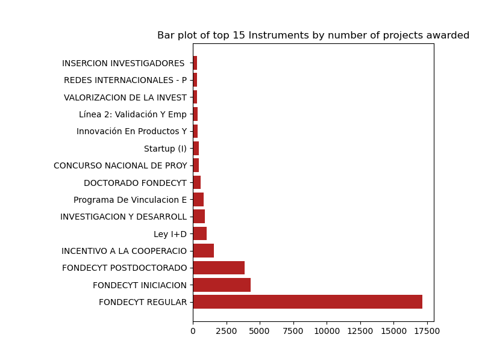
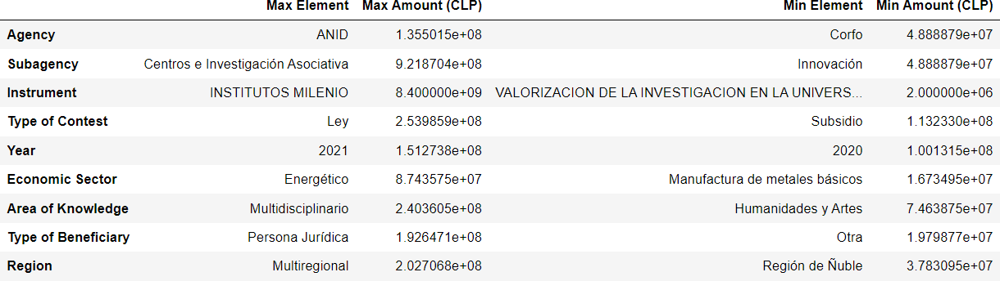
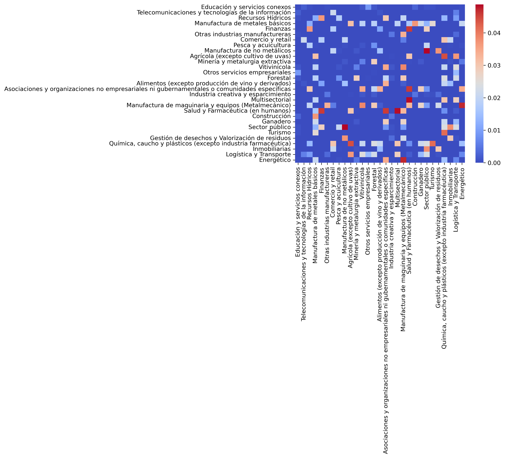
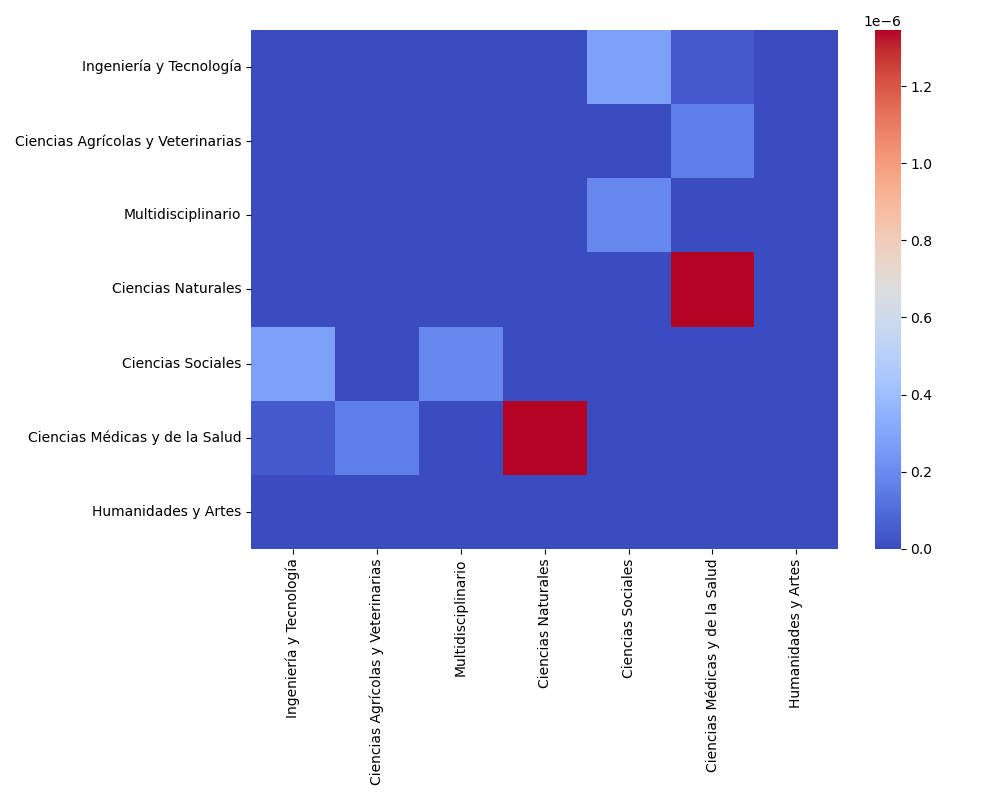
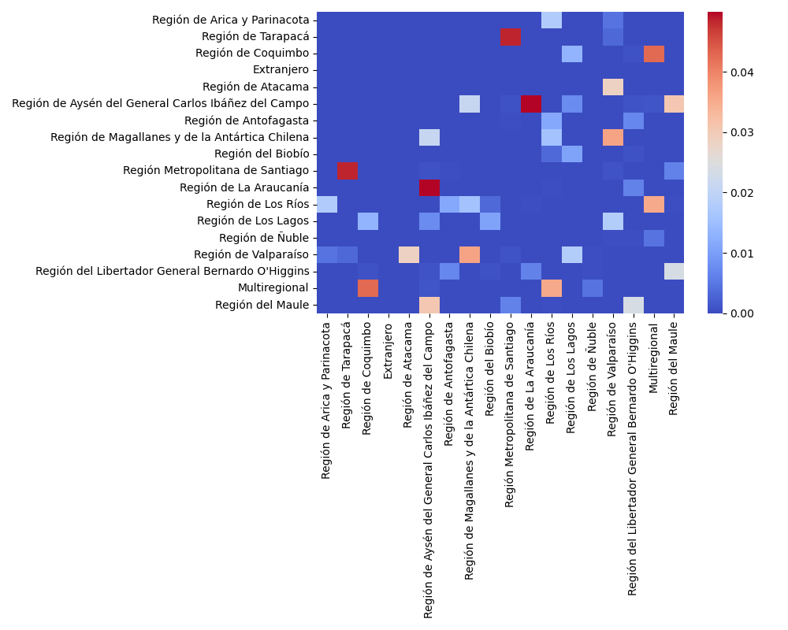

# Science and Technology in Chile: State funding between 1982 and 2022

Data analysis and visualization of Science and Technology projects that were given funding by the Chilean State between 1982 and 2022.

@Claudio-AhumadaL, 2023

## General Information

The aim of this project is to run an analysis over the Science and Technology funding awarded by the Chilean State between the years 1982 to 2022. I expect to run descriptive and exploratory analysis over the data, which was collected from the [OBSERVA](observa.minciencia.gob.cl) platform of the Chilean Ministry of Science. I expect to condense my findings in a dashboard made using Tableau for proper visualization.

### Scope

 This project is an exploratory endeavor with the global objective of understanding the route that has been taken by the Chilean Ministry of Science to award funding to projects over the last 40 years. This analysis will serve to showcase the importance given by this State to different technological and scientific areas, considering that this funding is one of the main sources of economic intake for science and techonology in this country.

### Goals

The main goal of this project is to get a clear overview of the direction that the chilean State's Ministry of Science has taken during the 40 year period available in the data (1982 to 2022). I expect to analyze categories such as Area of Knowledge, Type of Funding, Amounts and Region of Execution of the projects, as well as the relationship between these categories. This project will be considered successful after performing descriptive and exploratory analysis over the data and then producing an interactive and informative dashboard to showcase the findings.

Some questions I want to answer with this report are:

    - What are the trends in funding for different scientific and technological areas over the past 40 years? 
    - How have funding priorities shifted over time? 
    - Are there any areas that have consistently received more funding than others?

### Actions

This project could provide insights to interested groups, such as consulting companies or think thanks, that are interested in getting to know how the Chilean State has been assigning funding over the last 40 years for scientific and technological enterprises. It could also help the interested groups to evaluate if the funding has been aligned with the State's areas of interest (macroeconomically speaking), so they can counsel against or in favor of shifting the funding towards one or another area of interest. 

## Data

This project relies on data of the projects awarded through public support instruments for science, technology, knowledge and innovation, executed by the State agencies ANID, CORFO and the CTCI Undersecretariat. This data was taken from the [OBSERVA](observa.minciencia.gob.cl) platform of the Chilean Ministry of Science and covers the period between 1982 and 2022.

The data included 47818 projects with a total amount given of 3.849.542.375.552 CLP. Not all projects have a full set of information, with 8908 NaN values in the 'Concurso', 'TipoBeneficiario' and the 'AreaConocimiento' columns, '38932' in the 'Objetivo' column, '249' in the 'Institución' column, '38910' in the SectorEconomico column and '1540' in the 'Monto' column.

It's important to note for the 'RegionEjecucion' column analysis that the regions of Arica y Parinacota and Los Ríos were created in 2007 while the Ñuble region was created in 2018, which can introduce bias in said analysis.

## Methods

  ### Initial definitions

The data will be cleaned and inspected using the python library Pandas. Statistical analysis will rely on the python libraries NumPy and SciPy. Exploratory visualization will be performed using the python library Matplotlib. The final dashboard will be constructed using Tableau Public.

This dataframe (called sf_data) has 2 types of columns, namely:

1. Categorical
2. Numerical

Restricting to consider only the columns of interest, the numerical category has just two columns ('Monto' column, the amount granted by the state, and the 'Año' column, the year). The Categorical category is divided in three narrower categories:

1. Categorical - State Agencies and Sub-Agencies ('Agencia' - Agency, 'Subdirección' - Sub-agency)
2. Categorical - Funding Instruments ('Instrumento' - Instrument, 'Contests' - Concursos, 'Tipo de Fondo' - Type of Funding)
3. Categorical - Awardees ('SectorEconomico' - Economic Sector, 'AreaConocimiento' - Area of Knowledge, 'TipoBeneficiario' - Type of Beneficiary or Awardee, 'RegionEjecucion' - Region of Execution)

The rest of the columns are not included in the analysis.

Later on the analysis, the dataframe was filtered to only get values for the last 5 years ('Año' > 2017) and then to only get the high earner projects (sf_data.sort_values(by=['Monto'], ascending = False).head(20)). Further analysis was performed over both of these subsets.

  ### Descriptive analysis

 The descriptive analysis is divided in three parts. In this list, they are further divided by the methods used in each one of them:

 1. Inspection
    - General inspection using sf_data.head(), sf_data.dtypes, sf_data.describe(include='all')
    - NaN values inspection using sf_data.isnull().sum()
    - Inspection of value counts of Categorical columns using sf_data[column].value_counts()

 2. Modification
    - Unify RegionEjecucion values that correspond to the same region using sf_data['RegionEjecucion'].replace()

 3. Descriptive analysis
    - Bar Plot: Number of projects by State Agencies, Sub-agencies, Area of Knowledge, Economic Sector, Instrument, RegionEjecucion.
 
  ### Exploratory analysis

 The exploratory analysis is divided in two parts:

 1. Visual exploratory analysis 
    - 'Monto' vs 'Año' Scatter plot and 'Monto' vs 'code of project' for the top 20 highest earner projects.
    - Heatmap of the result of the post-hoc statistical test (Dunn's test) for 'SectorEconómico' and 'Area of Knowledge' groups using Seaborn's heatmap() function.

 2. Grouping-based exploratory analysis 
    - Grouped tables for Agency, Subagency, Instrument, Type of contest, year of execution, Economic Sector, Area of Knowledge, Type of Beneficiary and region of execution using sf_data.groupby([category]).Monto.mean()
    - Summarizing table with the max and min values for every category
    - Value counts of the year of execution, Instrument, Region of Execution and Area of Knowledge of the top 20 highest earner projects.
    - Grouped tables for Agency, Subagency, Instrument, Type of contest, year of execution, Area of Knowledge, Type of Beneficiary and region of execution using sf_data.groupby([category]).Monto.mean() over the top 20 highest earner projects
    - Summarizing table with the max and min values for every category for the top 20 highest earner projects.
    - Grouped tables for Agency, Subagency, Instrument, Type of contest, year of execution, Economic Sector, Area of Knowledge, Type of Beneficiary and region of execution using sf_data.groupby([category]).Monto.mean() over the last 5 years of the data (2017-2022)
    - Summarizing table with the max and min values for every category over the last 5 years of the data (2017-2022).

   ### Statistical analysis

 For the statistical analysis, the first step was to evaluate the columns of interest for normality and homoscedasticity. The performed test were:

  1. Normality: Anderson-Darling test over 'Monto' and 'Year' column
  2. Homoscedasticity: Levene's test over 'SectorEconomico' and 'Monto', over 'AreaConocimiento' and 'Monto' and over 'RegionEjecucion' and 'Monto'

 This preliminary examination is important because it allows to define what test to use to analyze the data. Since the numeric columns are not normal, for example, a non-parametric test has to be used to perform it.

 Next, Kruskal-Wallis and Dunn's test were performed over these categories to search for diferences in the amount given for each group. Kruskal-Wallis tests allows to define if there are any difference in the median's of the inspected groups. Dunn's test is a post-hoc test that allows to determine which groups show differences between them. The performed tests were:

  1. Kruskal-Wallis and Dunn's test with the Benjamini-Hochberg procedure were performed over the amount given to each 'SectorEconomico' group.
  2. Kruskal-Wallis and Dunn's test with the Bonferroni correction were performed over the amount given to each 'AreaConocimiento' group.
  3. Kruskal-Wallis and Dunn's test with the Bonferroni correction were performed over the amount given to each 'RegionEjecucion' group.

 ## Results

   ### Descriptive Analysis

   #### Initial visualizations

 The dataframe has 47,818 rows. The 'amount' column ('Monto') has a mean of 8.318299e+07 CLP with a standard deviation of 3.362285e+08. This high number suggests that there are important outliers in this column, which correspond to high-earner projects on one hand and projects with null or low amounts earned on the other.

The broadest category is 'Agencia,' where the vast majority of entries correspond to the ANID agency (38,263), followed by the CORFO agency (8,908), and finally a small number to Subsecretaría CTCI (647).

Every agency has subagencies that depend on them. In this dataset, the 'Subdirección' column has six valid values and one invalid ('No Aplica'). The most repeated value was "Proyectos de Investigación" with 27,654 projects (58% of the valid values group).

 

 With respect to the funding instruments, 398 different instruments of funding were reported in this dataset. The two most repeated instruments were "FONDECYT REGULAR" (17,143) and "FONDECYT INICIACION" (4,337). The 'Concurso' column reports 1,022 different values, with the top five values corresponding to "Regular" contests, making it by far the most important category in this matter.

 

 The 'Año' column shows the year that corresponds to each project. The top 13 values correspond to the period between 2010 and 2022, showing that the number of projects in the last decade was, on average, superior to before. It has to be said that from 2006 onwards, every year had at least 1,000 projects, with a maximum value of 3,092 financed projects in 2017.

 

 The 'Awardees' category divided the projects according to their Economic Sector, Area of Knowledge, Type of Beneficiary, and Region of Execution. In the case of the 'SectorEconomico' column, this column had 38,910 null values, so this has to be taken into account in the analysis. Having said that, the most used 'SectorEconomico' was 'Multisectorial,' with 922 values.

With regard to the Area of Knowledge, the most used value was 'Ciencias Naturales' with 16,086 values. The following category was 'Ciencias Sociales' with 6,308, which is interesting since it's usually an underrepresented category in Science and Technology projects.

With respect to the Type of Beneficiaries, the majority of projects were presented by the 'Persona Natural' category with 30,140 projects, followed by 'Persona Jurídica' with 8,368 projects.

Finally, the 'RegionEjecucion' column shows that the vast majority of projects (26,600) come from the Metropolitan Region of Santiago. The following two regions are Valparaíso (4,981) and Biobío (4,706).

 
### Exploratory Analysis

#### General Group

The exploratory analysis of the general group of projects shows interesting findings.

It starts with a scatter plot of the amount granted (using a logarithmic scale) to each project by the year of execution of the project.

As it can be seen, the amount granted by projects started to stabilize between the 1E06 and 1E08 CLP amounts from around 1990 and onwards. Around 2017 there were some outliers in the form of high earner projects. It's interesting to note that the orders of magnitude of the amounts have been somewhat constant during the last 10 years, which is something that should be looked upon.

Next, a grouping-based exploratory analysis was performed over the columns listed in the Methods section, grouping each column by their distinct values and calculating the average amount granted to the projects that belong to each group. 

The grouped table for the 'Agencia' columns showed that, on average, ANID projects granted an amount of 8.98E7 CLP, while CORFO and Subsecretaría CTCI had values of 5.85E7 and 4.58E7. This shows that on average these agencies grant approximately the same amount per project.

The grouped table for the 'subsecretaría' column showed that the highest average amounts were granted by Centros e Investigación Asociativa (8.6E8 CLP) and Investigación Aplicada e Innovación (1.14E8 CLP). The minimum value corresponds to REC, with 4.02E7, about one order of magnitude less than the max.

The grouped table for the 'instrumento' column had a massive difference between the group with the highest amount and the group with the lowest amount: CENTRO CIENTÍFICOS Y TECNOLÓGICOS DE EXCELENCIA (Financiamiento Basal) with 1.1E10 CLP and Concurso Clubes CAICE with 6E5 CLP. This makes sense, since instruments have a different scope. For example, some instruments (such as the max average amount instrument presented here) are directed to major centers of R+D, so the amounts given are of a higher order. Some other projects are directed toward persons that have projects with narrower scopes, so those amounts are lower. 

The 'Type of Contest' column has only two different groups, 'Ley' and 'Subsidio'. Their average amounts show differences, with 'Ley' having an average amount of 2.97E6 and 'Subsidio' having an average amount of 8.5E7. This may be related with legal constraints regarding a Ley versus a Subsidio contest, as well as the specific instruments that correspond to each category. Further exploration needs to be performed to elucidate this.

The analysis of the Year column's average amounts showed peaks in the average amount granted in the years 2001, 2007, 2009, 2019 and 2022. The max amount corresponded to the year 2007 with 1.46E8 CLP. It would be interesting to continue exploring what happened on these years that ramped up the average amount granted.

The 'SectorEconomico' column had all its groups in the same order of magnitude. The highest average amount corresponded to the Vitivinicola group with 9.28E7 CLP and the lowest average amount corresponded to the Manufactura de Metales Básico group with 2.68E7 CLP.

The 'AreaConocimiento' column had a range of average amounts ranging between Humanidad y Artes (4.47E7) and Multidisciplinario (2.18E8). It was expected that projects coming from Natural Sciences and Technology (as well as multidisciplinary projects) had higher average amounts than projects coming from the humanities. This result corresponded with said expectation.

Regarding the 'TipoBeneficiario' column, the highest average amount corresponded to the 'Persona Juridica' group, with 1.65E8 CLP, while the lowest average amount corresponded to the category 'Otro' (2.15E7 CLP). Sadly, there is not enough information provided to elucidate what this category stands for. 

The 'RegionEjecucion' column has a higher average amount coming from the 'Multiregional' group (2.03E8 CLP), and a lower average amount coming from the 'Extranjero' group (6909239.11 CLP).

This information is summarized in the following table:

#### High earner projects

For the group of the TOP 20 highest-earner projects, the following bar plot presents the amount given to each of the projects in said category, ranging approximately between 8.8E9 CLP and 1.75E10 CLP.

The projects of this group came from the years 2007 (5 projects), 2009 (4 projects), 2014 (4 projects), 2012 (4 projects), 2021 (2 projects) and  2010 (1 project). The highest average amount came from the year 2007 and had an amount of 1.33e10 CLP, while the project that had the minimum average amount came from the year 2012, with an amount of 8.93E9 CLP.

Regarding the 'Instrumento' column, 13 projects came from the insturment 'CENTROS CIENTIFICOS Y TECNOLOGICOS DE EXCELENCIA (FINANCIAMIENTO BASAL)', with 2 more coming from 'FINANCIAMENTO BASAL', which is a similar instrument, so 75% of the top 20 high earner projects. This makes sense, since this instrument is directed toward Universities or Scientific Centres so the amount that they give is superior. The other 5 projects of this group had an instrument of 'CENTROS DE INVESTIGACIÓN EN AREAS PRIORITARIAS', which has the same scope.

The highest average amount in this column was of 1.13E10 CLP, corresponding to the 'CENTROS CIENTIFICOS Y TECNOLOGICOS DE EXCELENCIA (FINANCIAMIENTO BASAL)' group, while the minimum amount was of 8.93E9 CLP and came from Centros e Investigación Asociativa.

The region with most high earner projects was, unsurprisingly, the Metropolitan Region of Santiago, with 15 projects. The highest average came from Los Ríos Region (which has only 1 project in this table), with 1.75E10 CLP. The lowest average amount came from the Region del BioBío group, with 8.97E9 CLP.

With respecto to the 'AreaConocimiento' column, the group was somewhat evenly distributed by Ciencias Naturales (7 projects), 'Ingeniería y Tecnología' (6 projects) and 'Multidisciplinario' (6 projects). There was only 1 project from 'Ciencias Sociales' in this group, which is consistent with the lower amounts that this group historically has gotten from the State funding-wise. 

The Ciencias Sociales group is reported as the group with the highest amount (1.35E10 CLP), but this is influenced by its number of values. The lowest average amount corresponded to the Multidisciplinario group, with 9.6E9.

The 'EconomicSector' column of this group was empty, and both the 'Type of Contest' and 'Type of Beneficiary' columns have only one value. This information is summarized in the following table:

#### Projects from the last 5 years

The 'Agencia' group of the subset of projects where `'year' > 2017` and `'monto' > 0` has a maximum average value corresponding to the ANID group (1.35E8 CLP) and a minimum average value corresponding to the group 'Corfo' (4.89E7 CLP).

The 'subagencia' column has a maximum average value corresponding to the 'Centros e Investigación Asociativa' group (9.22E8 CLP) and a minimum average value corresponding to the 'Innovación' group (4.89E7 CLP)

The maximum average value of the 'Instrument' column corresponds to the 'INSTITUTOS MILENIO' group (8.4E9) with the minimum average value corresponding to the 'VIU' group, which as a fixed amount of 2.000.000 CLP.

Regarding the 'Type of Contest' column, the 'Ley' group has the maximum average value (2.54E8 CLP) while the 'Subsidio' group has the minimum average value (1.13E8 CLP).

The maximum average per year showed that the group with the highest average is the year 2021 (1.51E8 CLP) and the group with the lowest average is the year 2020 (1.00E8 CLP). The similarity of these values show that the average per year has been similar the last 5 years.

For the 'EconomicSector' column, the maximium average value corresponds to the 'Energético' sector (8.74E7 CLP) and the minimum average value corresponds to the 'Manufactura de metales básicos' group (1.67E7) CLP.

The 'AreaConocimiento' column shows that the maximum average amount comes from the 'Multidisciplinario' group (2.4E8 CLP). The minimum average amount comes from the 'Humanidades y Artes' group (7.46E7 CLP).

The 'Type of Beneficiary' column shows the same behaviour that in the general group, with the maximum average amount coming from the 'Persona Jurídica' group (1.93E8 CLP) and the minimum average amount coming from the 'Otra' group (1.98E7 CLP).

Lastly, the 'RegionEjecucion' column has its maximum average amount corresponding to the 'Multiregional' group (2.03E8 CLP) and its minimum average amount corresponding to the Ñuble Region (3.79E7).

This information is summarized in the following table:

### Statistical Analysis

#### Normal distribution evaluation for 'Monto' and 'Year' columns.

To check if the 'Monto' column has a normal distribution, an Anderson-Darling test was performed. The resulting statistic was of 10997.31 with critical values of [0.576, 0.656, 0.787,  0.918, 1.092]. Since the statistic is higher that every critical value, we can assure that this data is not normally distributed.

The same test was applied over the 'Year' column. The statistic was of 1608.71, while the critical values were 
[0.576, 0.656, 0.787, 0.918, 1.092]. This column is not normally distributed.

#### Homoscedasticity evaluation of 'SectorEconomico', 'AreaConocimiento' and 'RegionEjecucion' versus 'Monto'.

To evaluate for Homoscedasticity, a Levene's test was performed over the name columns and the 'Monto' column.

For 'SectorEconomico' the Levene's test statistic was of 2.9678, which is relatively small. The p-value obtained was 2.5058e-07, which is much smaller than the commonly used significance level of 0.05. This suggests strong evidence against the null hypothesis of equal variances across groups.

For 'AreaConocimiento', the Levene's test statistic is 33.3, which is somewhat high. Nonetheless, the p-value is 2.5058e-40, which is much smaller than the commonly used significance level of 0.05. This suggests strong evidence against the null hypothesis of equal variances across groups.

For 'RegionEjecucion', the Levene's test statistic is 2.13, which is small. The p-value was of 0.003, which is smaller than the commonly used significance level of 0.05. This suggests evidence against the null hypothesis of equal variances across groups.

As seen, none of these columns shows homoscedasticity when compared to the 'Monto' column. This, coupled with the non-normal distribution of the 'Monto' column, shows that to evaluate differences between these groups a non-parametric test should be used.

#### Kruskal-Wallis and Dunn's test for 'SectorEconomico'.

The Kruskal-Wallis test performed over this column's groups relative to their 'Monto' medians gave an statistic of 655.8 and a p-value of 1.33e-54, which is considerably smaller than the significance level of 0.05. Thus, it can be concluded that there is a statistically significant difference between the amount given to it's groups.

Since this column has 29 different valid groups, a correction had to be implemented alongside the Dunn's test. This would ensure that the results of the Dunn's test, which shows which groups have differences among their 'Monto' values, are statistically significant. 

For this group, the correction used was the Benjamini-Hochberg procedure, which is not as conservative as other corrections, so it controls the overall false negative rate better. The resulting matrix was processed using a Heatmap, giving the following results:

#### Kruskal-Wallis and Dunn's test for 'AreaConocimiento'.

The Kruskal-Wallis test performed over this column's groups relative to their 'Monto' medians gave an statistic of 533.2 and a p-value of 5.91e-112, which is considerably smaller than the significance level of 0.05. Thus, it can be concluded that there is a statistically significant difference between the amount given to it's groups.

Since this column has 7 different valid groups, a correction had to be implemented alongside the Dunn's test. This would ensure that the results of the Dunn's test, which shows which groups have differences among their 'Monto' values, are statistically significant. 

For this group, the correction used was the Bonferroni correction, which is more conservative so it controls the overall false positive rate better. The resulting matrix was processed using a Heatmap, giving the following results:

#### Kruskal-Wallis and Dunn's test for 'RegionEjecucion'.

The Kruskal-Wallis test performed over this column's groups relative to their 'Monto' medians gave an statistic of 29911 and a p-value of 1.71e-53, which is considerably smaller than the significance level of 0.05. Thus, it can be concluded that there is a statistically significant difference between the amount given to it's groups.

Since this column has 13 different valid groups, a correction had to be implemented alongside the Dunn's test. This would ensure that the results of the Dunn's test, which shows which groups have differences among their 'Monto' values, are statistically significant. 

For this group, the correction used was the Bonferroni correction, which is more conservative so it controls the overall false positive rate better. The resulting matrix was processed using a Heatmap, giving the following results:

## Conclusions

Overall, the report provides insight into the trends of funding for scientific and technological areas over the past 40 years in Chile. The conclusions drawn from the analysis of the data can be summarized as follows:

1. The trends in funding for different scientific and technological areas over the past 40 years are inclined toward Biological Sciences and Technology. Social sciences and Humanities and Arts have 8770 projects combined, while the rest (excluding Multidisciplinary projects and projects that didn't inform an Area of Knowledge) have a project count of 28683 projects.
2. Over the whole period, Ciencias Naturales has been the group with more projects. From 2013 and onwards Ciencias Sociales had surpassed Ingeniería y Tecnología for the second place, but this trend shifted again between 2020 and 2021.
3. The average amount given to each of these Areas of Knowledge suffered different changes over the years. Until 2019-2020, Ciencias Agrícolas y Veterinarias had the highest average amount, but in that period was surpassed by Ciencias Naturales, Ciencias Médicas and Ingeniería y Tencología. The Multidisciplinary group shows the most variability, having peaks of average amounts between 2012 and 2015 and again in 2018. It's average amount descended in 2021. It has to be said that the average amount of the Ciencias Naturales and the Ciencias Agrícolas y Veterinarias have been slightly higher than the rest of the groups (excluding Multidisciplinary). It's interesting to note that the highest peak in Ingeniería y Tecnología happened in 2009, where it was higher than the rest of groups' averages. Nevertheless, the more notorious evidence of preference over these projects is prominently noted at the number of projects levels more than the average amount given.
4. In the case of the median amount of these groups, the last 2 years Ciencias Naturales and Ciencias Agrícolas y Veterinarias have peaked, surpassing the Multidisciplinary group, which median amount had growed to the top in 2018. Ciencias Naturales and Ciencias Agrícolas y Veterinarias have gotten consistently higher median amounts practically over all this period when Multidisciplinary is excluded from the analysis.
5. The region with the highest amount of projects is, by far, the Metropolitan Region of Santiago with 26600 projects over all this period. The following regions are Valparaíso Region and the Biobío Regions with 4981 and 4706 projects respectively. This seems like the area with the highest practical differences and the most problematic consequences funding-wise. 
6. Regarding economic sectors, this column has a high number of null values, so the conclusions extracted from its analysis has to take this into account. That said, the Economic Sector with the highest average amount is the Vitivinícola sector while the sector with the lowest average amount is the Manufactura de Metales Básicos sector. It's interesting to note that the Multisectorial economic sector has a high average amount (67274804 CLP), ranking 5th in descending order.
7. With respect to the instruments that gave funding over these years, the top 3 instruments were Fondecyt Iniciación, Fondecyt Postdoctorado and Incentivo a la Cooperación Internacional. This trends change when filtering for only the projects from the last 5 years, where the most projects come from Fondecyt Regular, Fondecyt Iniciación and Fondecyt Postdoctorado, in that order.

Overall, the report highlights the preferences in funding for different scientific and technological areas, the uneven distribution of funding across different regions of Chile, and the importance of considering both the number of projects funded and the average/median amounts given when analyzing funding trends. However, the conclusions drawn from the analysis should be taken with caution, particularly when it comes to the analysis of economic sectors, which has a high number of null values.